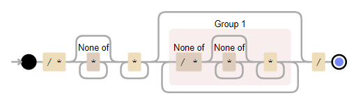

## 1 词法分析

使用Lex作为词法分析工具，词法分析见文件```lex.l```，参考了ANSI C的Lex http://www.quut.com/c/ANSI-C-grammar-l-1998.html。

### 1.1 规则声明

整数字面量支持八进制、十进制和十六进制。定义和标准C语言相同，0开头为八进制，0x或0X开头为十六进制，其他为十进制。浮点数仅支持十进制。

```lex
oct_int		0[0-7]*
dec_int		0|([1-9][0-9]*)
hex_int		0[xX][0-9a-fA-F]+

any_int     {oct_int}|{dec_int}|{hex_int}
float		{dec_int}"."[0-9]*
```

标识符的定义和C语言相同，即以大小写字母和下划线开头，后面接大小写字母、下划线或数字。

```lex
identifier	[a-zA-Z_][a-zA-Z0-9_]*
```

注释支持C风格的注释和C++风格的注释。

```lex
c_comment	\/\*[^*]*\*+([^/*][^*]*\*+)*\/
cpp_comment	\/\/.*
comment		{c_comment}|{cpp_comment}
```

C风格注释正则表达式为```\/\*[^*]*\*+([^/*][^*]*\*+)*\/```，它的构成比较复杂。我们可以用正则表达式可视化工具可视化上述正则表达式。



空白字符使用lex内建的定义

```lex
whitespace	[[:space:]]+
```

### 1.2 模式匹配

词法分析代码识别所有关键字和多字符的操作符并以整数(枚举)方式返回给语法分析器。这些枚举值定义在```parser.y```中。

```lex
"auto"			{ return AUTO; }
"void"          { return VOID; }
"char"          { return CHAR; }
"short"         { return SHORT; }
">>="			{ return RIGHT_ASSIGN; }
"<<="			{ return LEFT_ASSIGN; }
"+="			{ return ADD_ASSIGN; }
...
```

识别所有字面量(整数字面量、浮点字面量和字符串字面量)，返回字面量的类型，并且同时拷贝字面量的字符串表示给词法分析器。我们```#define COPY_STR() yylval.str = strcpy((char*)malloc(strlen(yytext)+1), yytext)```，他将匹配的字符串保存下来，后续的解析过程会用到这些字符串。关于```yylval```的定义见语法分析部分。

```lex
{identifier}    	{ COPY_STR(); return IDENTIFIER; }
\"(\\.|[^\\"\n])*\"	{ COPY_STR(); return STRING_LITERAL; }
{any_int}       	{ COPY_STR(); return NUM_INT; }
{float}				{ COPY_STR(); return NUM_FLOAT32; }
{float}"f"			{ COPY_STR(); return NUM_FLOAT64; }
```

对于注释和空白字符，直接丢弃不做处理。对于其他字符，直接返回这个字符给词法分析器。

```lex
{whitespace}    {}
{comment}    	{}
.               { return yytext[0]; }
```