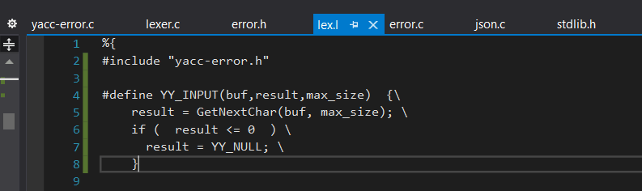
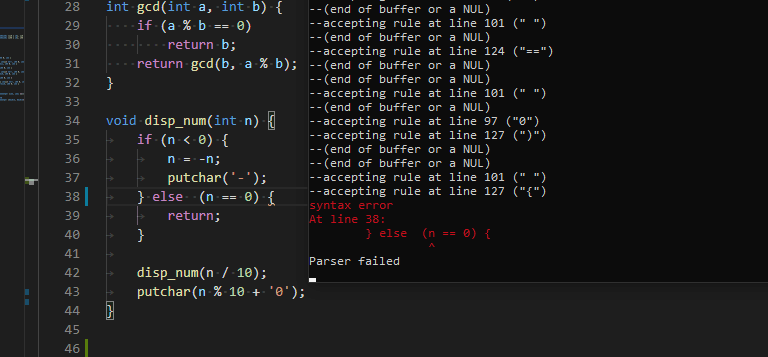
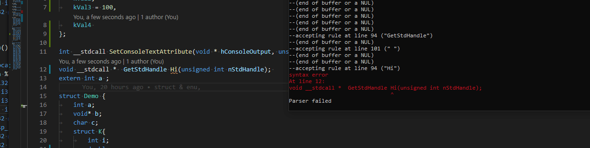
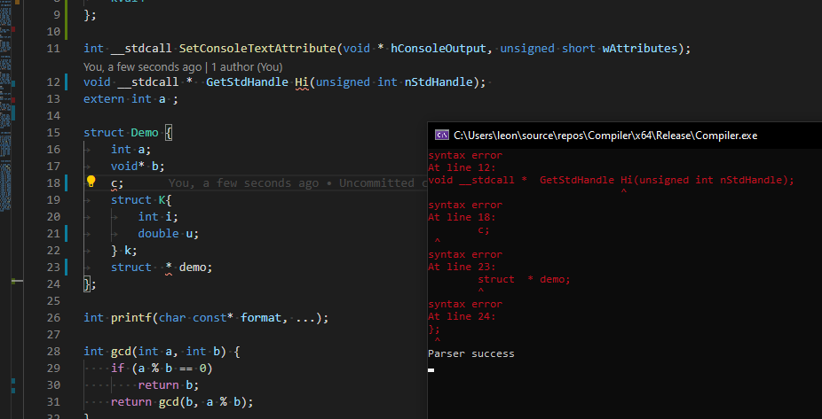

## 2 YACC
### 2.1 语法分析
使用Yacc作为与语法分析工具，语法分析见文件```yacc.l```，参考了：
- ANSI C的Yacc http://www.quut.com/c/ANSI-C-grammar-y-1998.html
- Microsoft官方文档 https://docs.microsoft.com/en-us/cpp/c-language/phrase-structure-grammar?view=vs-2019

接下来我们将从```External Defination```, ```Statements```, ```Declarations```和```Expression```四个方面介绍语法分析的主要结构，由于完整的parser.y过长，因此我们仅提及比较重要的部分
### External Defination
#### translation_unit 
语法分析将```tranlation_unit```作为解析的起始符号，将整个代码分成数个```external_declaration```， 并将解析出的```external_declaration```在动作中插入AST
```
translation_unit 
    : external_declaration                      { parser_result = $1; $$ = $1; }
    | external_declaration translation_unit     { parser_result = $1; $$ = ast_append($1, $2); }
    ;
```
#### external_declaration
```external_declaration```分为```function_defination```和```declaration```两种，分别为函数定义和变量定义
```
external_declaration
    : function_definition      { $$ = $1; }
    | declaration              { $$ = $1; }
    ;
```
#### function_definition
```function_definition```分为三部分，```declaration_specifiers```确定函数返回类型，```declarator```确定函数的名字和参数列表，```compound_statement```则代表函数的主体
```
function_definition
	: declaration_specifiers declarator compound_statement                { $$ = make_define_function($1, $2, $3); }
	;
```
### Declaration
#### declaration
```declaration```是变量声明的开始，由```declaration_speciifers```变量类型和```init_declarator_list```变量声明列表组成
```
declaration
    : declaration_specifiers init_declarator_list ';'                      { $$ = make_declaration($1, ATTR_NONE, $2); }
    ;
```
#### init_declarator_list
```init_declarator_list```由数个```init_declarator```组成
```
init_declarator_list
    : init_declarator                           { $$ = $1; }
    | init_declarator ',' init_declarator_list  { $$ = ast_append($1, $3); }
	;
```
init_declarator为declarator变量声明和initializer可选的变量初始化组成
```
init_declarator
	: declarator                  { $$ = $1 }
	| declarator '=' initializer  { $$ = make_declarator_with_init($1, $3); }
	;
```
#### declarator 
```declarator```支持变量、指针（包括函数指针）、数组的声明
```
declarator
    : pointer direct_declarator { $$ = make_declarator($1, $2); }
    | direct_declarator         { $$ = $1; }
    ;

direct_declarator
    : IDENTIFIER                     { $$ = makr_init_direct_declarator($1); }
	| '(' declarator ')'         { $$ = $2; }
    | direct_declarator '(' ')'      { $$ = make_extent_direct_declarator($1, TP_FUNC, NULL); }
    | direct_declarator '(' parameter_list ')'      { $$ = make_extent_direct_declarator($1, TP_FUNC, $3); }
    | direct_declarator '[' ']'                     { $$ = make_extent_direct_declarator($1, TP_ARRAY, NULL); }
    | direct_declarator '[' constant_expression ']' { $$ = make_extent_direct_declarator($1, TP_ARRAY, $3); }
    ;
```
### Expression
Expression部分通过消除左递归和文法改造的方法，为操作符设定了正确的优先级,更底层的表达式拥有更高的优先级
#### assignment_expression
赋值表达式可以```conditional_expression```条件表达式或者是为```unary_expression```进行赋值
```
assignment_expression
	: conditional_expression { $$ = $1; }
	| unary_expression assignment_operator assignment_expression { $$ = make_binary_expr($2, $1, $3); }
	;
```
#### constant_expression
```constant_expession```可以是```logical_or_expression```逻辑或表达式或者进行条件判断
```
conditional_expression
	: logical_or_expression { $$ = $1; }
	| logical_or_expression '?' expression ':' conditional_expression { $$ = make_trinary_expr(OP_CONDITIONAL, $1, $3, $5 ); }
	;
```
逻辑与、加减乘除和移位表达式的结构都类似，因此我们直接跳到```unary_expression```一元表达式
#### unary_expression
一元表达式分为前缀和后缀两种，```unary_expression```可以为后缀表达式，或者是```sizeof()```、```++```、```--```、或者取地址```&```、取值```*```操作
```
unary_expression
	: postfix_expression      { $$ = $1; }
	| INC_OP unary_expression { $$ = make_unary_expr(OP_INC, $2); }
	| DEC_OP unary_expression { $$ = make_unary_expr(OP_DEC, $2); }
	| unary_operator cast_expression { $$ = make_unary_expr($1, $2); }
	| SIZEOF unary_expression { $$ = make_unary_expr(OP_SIZEOF, $2); }
	| SIZEOF '(' type_name ')' { $$ = make_unary_expr(OP_SIZEOF, $3); }
	;
```
#### postfix_expression
后缀表达式有```++```、```--```、数组取值和函数调用几种,或者是最底层的```primary_expression```
```
postfix_expression
	: primary_expression                     { $$ = $1; }
	| postfix_expression '[' expression ']'  { $$ = make_binary_expr(OP_ARRAY_ACCESS, $1, $3); }
	| postfix_expression '(' ')'                            { $$ = make_function_call($1, NULL); }
	| postfix_expression '(' argument_expression_list ')'   { $$ = make_function_call($1, $3); }
	| postfix_expression '.' IDENTIFIER      { $$ = make_binary_expr(OP_STACK_ACCESS, $1, make_identifier($3)); }
	| postfix_expression PTR_OP IDENTIFIER   { $$ = make_binary_expr(OP_PTR_ACCESS, $1, make_identifier($3)); }
	| postfix_expression INC_OP              { $$ = make_unary_expr(OP_POSTFIX_INC, $1); }
	| postfix_expression DEC_OP              { $$ = make_unary_expr(OP_POSTFIX_INC, $1); }
	;
```
#### primary_expression
根表达式可以是变量、各种类型的数字、字符串以及用```()```包含的表达式

```
primary_expression
	: IDENTIFIER          { $$ = make_identifier($1); }
	| NUM_INT             { $$ = make_number_int($1, TP_INT64); }
	| NUM_FLOAT32         { $$ = make_number_int($1, 32); }
	| NUM_FLOAT64         { $$ = make_number_int($1, 64); }
	| STRING_LITERAL      { $$ = make_string($1); }  
	| '(' expression ')'  { $$ = make_list_expr($2); }
	;
```
### Statement
Statement为代码中的用```;```隔离的语句
Statement分为：
- labeled_statement
- compound_statement
- expression_statement
- selection_statement
- iteration_statement
- jump_statement
#### labeled_statement
标签语句主要是switch语句中的```CASE```和```Default```标记的block
```
labeled_statement
	: IDENTIFIER { notify_label($1); } ':' statement                     { $$ = make_label($1, $4); }
	| CASE    { notify_label(NULL); } constant_expression ':' statement  { $$ = make_label_case($3, $5); }
	| DEFAULT { notify_label(NULL); } ':' statement                      { $$ = make_label_default($4); }
	;
```
#### expression_statement
表达式语句为用表达式作为一个语句，比如赋值语句
```
expression_statement
    : ';'                                       { $$ = make_empty(); }
    | expression ';'                            { $$ = $1; }
    ;
```
#### selection_statement
分支语句包括```if```和```switch```两种，这里值得一提的是，if-esle会有ELSE悬挂的问题，导致移入-规约冲突，我们这里是让yacc默认的优先移入的原则来解决冲突
```
selection_statement
	: IF '(' expression ')' statement                  { $$ = make_ifelse($3, $5, NULL); }
	| IF '(' expression ')' statement ELSE statement   { $$ = make_ifelse($3, $5, $7); }
	| SWITCH '(' expression ')' statement              { $$ = make_switch($3, $5); }
	;
```
#### iteration_statement
迭代语句包括```while```、```do-while```和```for```三种循环,然后为了在解析过程中插入动作，我们设置了notify_loop这个空的derivation，原本YACC在中间的动作也会设置匿名的derivation来帮助解析，但是这里我们直接依靠匿名实现动作的话，会有规约冲突的warning，因此我们改用notify_loop来消除warning
```
iteration_statement
	: WHILE { notify_loop(LOOP_WHILE); } '(' expression ')' statement                                         { $$ = make_loop($4, NULL, $6, NULL, LOOP_WHILE); }
	| DO    { notify_loop(LOOP_DOWHILE); }   statement WHILE '(' expression ')' ';'                           { $$ = make_loop($6, NULL, $3, NULL, LOOP_DOWHILE); }
	| FOR   notify_loop '(' expression_statement expression_statement ')' statement            { $$ = make_loop($5, $4, $7, NULL, LOOP_FOR); }
	| FOR   notify_loop '(' expression_statement expression_statement expression ')' statement { $$ = make_loop($5, $4, $8, $6, LOOP_FOR); }
	| FOR   notify_loop '(' declaration expression_statement ')' statement                     { $$ = make_loop($5, $4, $7, NULL, LOOP_FOR); }
	| FOR   notify_loop '(' declaration expression_statement expression ')' statement          { $$ = make_loop($5, $4, $8, $6, LOOP_FOR); }
	;

notify_loop
	: { notify_loop(LOOP_FOR); }
	;
```
#### jump_statment
跳转语句主要是在函数或者循环中进行跳转的语句
```
jump_statement
	: GOTO IDENTIFIER ';'   { $$ = make_jump(JUMP_GOTO, $2, NULL); }
	| CONTINUE ';'          { $$ = make_jump(JUMP_CONTINUE, NULL, NULL); }
	| BREAK ';'             { $$ = make_jump(JUMP_BREAK, NULL, NULL); }
	| RETURN ';'            { $$ = make_jump(JUMP_RET, NULL, NULL); }
	| RETURN expression ';' { $$ = make_jump(JUMP_RET, NULL, $2); }
	;
```
#### compound_statement
组合语句是用```{}```包括的语句的集合，函数的主体也是用compound_statement进行标记,里面包含了一系列的```declaration```和```statement```
```
compound_statement
    : '{' '}'                         { $$ = make_empty(); }
    | '{' { ast_notify_enter_block(); } block_item_list '}'         { $$ = make_block($3); }
    ;

block_item_list
    : block_item                      { $$ = $1; }
    | block_item block_item_list      { $$ = ast_append($1, $2); }
    ;

block_item
    : declaration                     { $$ = $1; }
    | statement                       { $$ = $1; }
    ;
```
至此，Yacc的语法部分我们基本讲解完毕


### 编译结果
我们通过```bison -v -t -o"parser.c" -d parser.y```进行编译并输出编译生成output文件查看冲突
可以看到只有两处移入/规约冲突

这两处分别是```IF-ELSE```和变量声明中的```initializer_list```,我们都能用YACC的优先移入而不是规约的原则处理，因此没有再继续改造文法。

### 2.2 错误检测
在之前YACC的基础上，通过修改YACC_INPUT的方式,进行了记录行号等操作，实现了错误检测功能


示例：

(1)



(2)


(3)



可以看到YACC错误指示位置和IDE的提示位置完全一致


### 2.3 错误恢复

在实验中我们为 Yacc 增加了错误恢复功能保证，这样子能够让 Yacc 在遇到错误的时候继续 Parse 下去。我们制定了如下规则:

```c++
declaration
    : declaration_specifiers attribute_specifier init_declarator_list ';'  { $$ = make_declaration($1, $2, $3); }
    | declaration_specifiers init_declarator_list ';'                      { $$ = make_declaration($1, ATTR_NONE, $2); }
	| declaration_specifiers ';'										   { $$ = make_declaration($1, ATTR_NONE, NULL); }
    | error ';' { yyerrok; $$ = make_empty(); }
	;
```

因此我们能够在所有错误位置报错，然后继续解析下去，示例:



注意连续报错，但是还是得到一棵正常的 AST。而且报错和 IDE 相同。