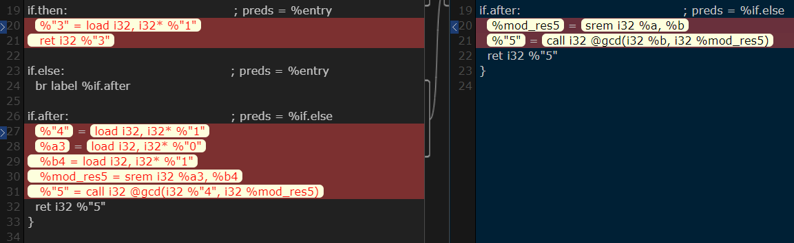
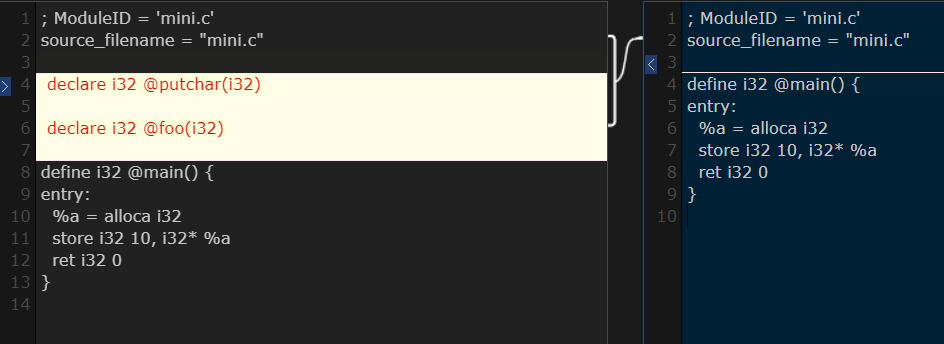

## 5 优化

### 5.1 LLVMBasicBlock约束

LLVM IR是由BasicBlock构成的，LLVM规定，br、ret这样的跳转语句只能出现在BasicBlock的末尾。这就要求我们在生成中间码的过程中，如果遇到return, continue或者break，就需要中止同一个Scope后续代码的生成。因为这些都是无条件跳转，后续代码必定不会被执行。在LLVM的BasicBlock规则的约束下，我们必须做这样的优化。

### 5.2 LLVM Pass

我们可以在LLVM IR生成后使用预置的优化Pass。我们在semantic.c的```do_eval```函数中添加了一些优化Pass并进行了实验。下面的对比图片，均为左侧对照组右侧实验组，对照组不采用任何优化。（因为LLVM-C缺乏文档，所以优化效果的解释多是我们观察优化前后IR的差异推测得到的）。

#### 5.2.1 ScalarReplAggregatesPassSSA

为实验组添加ScalarReplAggregatesPassSSA优化。可以发现生成的中间码长度大大缩短。发现减少了很多不必要的中间值。下面的图片是gcd代码的对比。我们发现，原先```gcd(b, a % b)```，传参的时候会先load实参b，形成一个中间值，再将中间值作为参数传入递归的gcd中，但是在优化之后，直接传实参b，没有load的过程。观察实验结果可以发现IR代码长度减少为原来的2/3.

```C
int gcd(int a, int b) {
    if (a % b == 0)
        return b;
    return gcd(b, a % b);
}
```



实验中发现NewGVNPass也会有很大程度的优化，优化效果类似ScalarReplAggregatesPassSSA。

#### 5.2.2 StripDeadPrototypesPass

为实验组添加StripDeadPrototypesPass优化。这个优化会删除代码中没有被使用到的函数原型。



