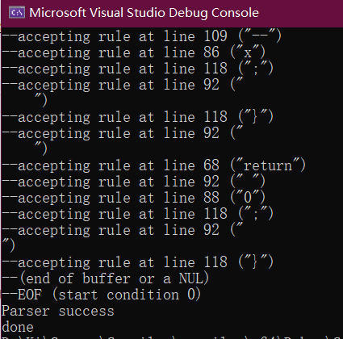

## 6 测试

### 6.1 AST可视化

我们编写了AST转json的代码，可以将抽象语法树转化为json。使用d3.js来实现json的树形可视化。具体方法是将生成data.json文件复制到d3文件夹下，而后在d3文件夹下控制台输入```python -m http.server```（要求安装python3），启动HTTP服务器。之后在浏览器中访问```localhost:8000```即可查看可视化的抽象语法树。这个抽象语法树是可以交互的，可以实现语法树节点的展开收起。d3.js的代码参考了http://bl.ocks.org/robschmuecker/7880033.

因为最终展示的是树状结构，而C语言单个文件生成的AST可能并不是一棵树而是一个森林。为了能够正确显示，在生成的json最外层可以套上一个伪根节点，如下所示

```JSON
{
    "name": "(ROOT)",
    "children": [
        // 编译器生成的json
        // ...
    ]
}
```

### 6.2 测试用例1

测试用例一着重测试了函数的声明、定义和调用。测试了参数中存在复杂表达式情况下编译器的表现。

```C
void putchar(int c);
int dummy(int a, float b, double c);
int main(int argc, char** argv) {
    putchar(104); // 'h'
    putchar(111); // 'o'
    putchar(108); // 'l'
    putchar(97);  // 'a'
    putchar(10);  // '\n'
    int x = dummy(8, 0.8f, (12 + 4 % 3) * 5.5);
    return 0;
}
```

经过我们的编译器生成AST后，进行可视化，效果如图所示.


复杂表达式```dummy(8, 0.8f, (12 + 4 % 3) * 5.5)```的AST细节如下图所示。


### 6.3 测试用例2

测试用例2着重测试了分支语句且条件判断中存在复杂表达式的情况。

```C
void putchar(int c);

int main(int argc, char* argv[]) {
    int x = 10;
    if ((x = (++x * 88 << 2) % 7)) {
        if (!x) {
            return 2;
        }
        return x;
    } else if (x < 10) {
        return 1;
    } else {
        putchar(--x);
        return --x;
    }
    return 0;
}
```

编译器生成的抽象语法树的可视化如下图所示


条件判断中的复杂表达式的详细情况如下图所示（为了着重显示条件判断，我们折叠了其他无关AST节点）


我们启用了yacc的调试输出，可以看到yacc解析时的日志，方便我们调试和测试。

