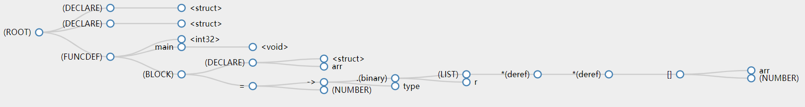
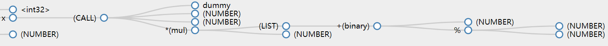

# Compiler

xxx, xxx, xxx

## 介绍

## 词法分析

使用Lex作为词法分析工具，词法分析见文件```lex.l```，参考了ANSI C的Lex[1]。

词法分析代码识别所有关键字(如```int```, ```static```)和多字符的操作符(如```+=```, ```==```)并以整数(枚举)方式返回给语法分析器；
识别所有字面量(整数字面量、浮点字面量和字符串字面量)，返回字面量的类型，并且同时拷贝字面量的字符串表示给词法分析器；
对于注释和空白字符，直接丢弃不做处理；
对于其他字符(单字符的操作符如```&```也属于这个类别)，直接返回这个字符给词法分析器。

注释支持C风格的注释和C++风格的注释。C风格注释正则表达式为```\/\*[^*]*\*+([^/*][^*]*\*+)*\/```

整数字面量支持八进制、十进制和十六进制。

标识符的定义和C语言相同，即以大小写字符和下划线开头，后面接大小写字符、下划线或数字。

## 语法分析

## 语义分析


### 类型数据结构


#### 类指针类型

C 语言的类型定义比较复杂，比如 microsoft 文档的一个例子:

```c
char *( *(*var)() )[10];
 ^   ^  ^ ^ ^   ^    ^
 7   6  4 2 1   3    5
```

这意味着我们需要一个能支持比较复杂嵌套的类型定义的结构，microsoft[^msdoc] 文档这个例子的解释是:

1. `var`是一个标识符，它被声明为
2. 一个指针，**指向**
3. 一个函数，这个函数**返回值**是
4. 一个10个元素的数组，数组的**元素的类型**是
5.  一个指针，**指向**
6. char

我们可以看到所有需要嵌套的类型它嵌套的对象不一样，具体来说，指针会嵌套指向什么类型，函数会嵌套返回值，而数组则是嵌套这个数组对应的类型，所以我们给这些嵌套单独的定义:

```c
// symbol.h

// nesting types:
struct TypeInfo {
    // ...
union
{
    struct Pointer
    {
        struct TypeInfo* pointing;
        int indirection;
    } ptr ;

    struct Array
    {
        struct TypeInfo* array_type;
        uint64_t array_count;
    } arr;

    struct Function
    {
        struct TypeInfo* return_type;
        struct TypeInfo* params;
    } fn ;
};
    // ...
}
```


#### 集合类型

还有一类特殊的类型是 union & struct 这样的特殊类型，出于性能考虑，C 对结构体的字段有严格的对齐要求，我们可以利用 C++ 在 IDE 里直接看到对齐情况：

```c++
// msvc-feature-test.cc

struct StructA
{
    char u;   // offset = 0, padding = 3
    int x;    // offset = 4, padding = 4
    double f; // offset = 8, padding = 0
    char j;   // offset = 16, padding = 7
};

static_assert(alignof(StructA) == 8, "结构体对齐按照最大算");
static_assert(sizeof(StructA) == 24, "结构体对齐后的大小");
```


所以我们需要一些字段来统计这些对齐信息:

```c
// symbol.h

struct TypeInfo {
	int alignment;       // 最小对齐要求, bytes
	int aligned_size;    // 对齐后所占的空间, bytes
	int offset;          // 如果是结构体, 距离结构体首部的距离
    // ...
}
```


C中还有 Bitfield 这种声明， 用以节省空间:

```c
struct
{
    int a:1;
    int b:2;
}
```

我们在类型中这样表示:

```c
struct TypeInfo {
	int bitfield_offset; // bit field 距离上一个非bitfield元素的距离
	int bitfield;        // bit field 占多少个字节
    //...
}
```


除此之外我们还要维护struct 每个字段，所以最终的结构如下:

```c
struct TypeInfo
{
	char* type_name;     // 类型的名称 (必须是 struct TypeInfo 第一个字段)
	int is_alias;   
	char* field_name;    // struct/union 字段名称
	enum Types type;     // 基础类型
    
	union
	{
        struct StructOrUnion
		{
			struct TypeInfo* child;
		} struc ;
    }
}
```


## ...

## 测试

### AST可视化

我们编写了AST转json的代码，可以将抽象语法树转化为json。使用d3.js来实现json的树形可视化。
具体方法是将生成data.json文件复制到d3文件夹下，而后在d3文件夹下控制台输入```python -m http.server```（要求安装python3），启动HTTP服务器。
之后在浏览器中访问```localhost:8000```即可查看可视化的抽象语法树。这个抽象语法树是可以交互的，可以实现语法树节点的展开收起。
d3.js的代码参考了[4].

因为最终展示的是树状结构，而C语言单个文件生成的AST可能并不是一棵树而是一个森林。为了能够正确显示，在生成的json最外层可以套上一个伪根节点，如下所示

```JSON
{
    "name": "(ROOT)",
    "children": [
        // 编译器生成的json
        // ...
    ]
}
```

例如如下C语言代码，经过我们的编译器生成AST后，进行可视化，效果如图所示.

```C
void putchar(int c);

int dummy(int a, float b, double c);

int main(int argc, char** argv)
{
    putchar(104); // 'h'
    putchar(111); // 'o'
    putchar(108); // 'l'
    putchar(97);  // 'a'
    putchar(10);  // '\n'
    int x = dummy(8, 0.8f, (12 + 4 % 3) * 5.5);
    return 0;
}
```





## 编译

编译 Lex 文件需要 Linux:

```bash
flex -d -o"lexer.c" lex.l
```


## 参考资料

[1] http://www.quut.com/c/ANSI-C-grammar-l-1998.html

[2] http://www.quut.com/c/ANSI-C-grammar-y-1998.html

[3] https://docs.microsoft.com/en-us/cpp/c-language/c-language-reference?view=vs-2019

[4] http://bl.ocks.org/robschmuecker/7880033


[^msdoc]: https://docs.microsoft.com/en-us/cpp/c-language/interpreting-more-complex-declarators?view=vs-2019